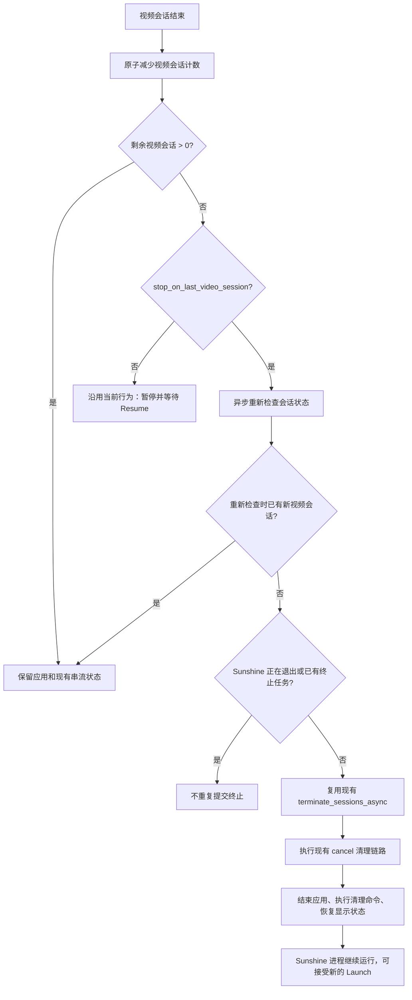

# 最后一个视频会话结束时停止串流

## 目标

Sunshine 目前在最后一个视频会话结束后，默认保留应用和串流上下文，以便客户端在短暂断线后通过 `Resume` 继续使用。这是当前默认行为，不能改变。

本设计增加一个可选的全局策略：当最后一个非控制视频会话结束时，主动结束本次串流并清理应用。用户可以在容易断网、希望离开电脑后自动收尾的场景启用它；不启用时，现有的断线恢复行为完全不变。

设计目标是提供一个简单的用户开关，而不是重新设计会话管理：不新增 HTTP 接口、不增加等待计时器、不引入每个应用的独立配置，也不复制一套新的清理流程。

## 用户入口

设置位置：WebUI → 常规。

在常规页现有的全局串流设置区域增加一个复选框：

> 所有客户端断开后结束串流

说明文字：

> 开启后，所有客户端断开时会结束应用并恢复显示状态；关闭时保留现有的断线恢复行为。自动清理会结束仍在保留的控制专用会话。

该选项：

- 默认关闭；
- 属于 Sunshine 全局设置，不属于某个应用；
- 与系统托盘、预览版通知等全局选项放在同一设置区域；
- 通过现有 `/api/config` 读取和保存，不增加新的前端 API；
- 保存后沿用 WebUI 现有的“应用”操作重启 Sunshine，重启后对后续会话生效；
- 不在 AppEditor、`apps.json` 或客户端配置中增加字段。

这样普通用户只需勾选一个选项即可使用；希望手动控制的用户仍可继续调用现有 `/cancel`。

## 配置模型

配置键：`stop_on_last_video_session`。

该键属于 `stream_t`，因为它描述的是 Sunshine 的会话生命周期策略，而不是某个应用的启动参数。配置文件仍由 Sunshine 的配置层负责读写，Sunshine WebUI 只通过现有配置 API 修改完整配置对象；控制面板不需要新增一套重复设置。

兼容规则：

- 配置键缺失时按 `false` 处理；
- `false` 保持当前行为；
- `true` 只改变“最后一个视频会话结束”的处理分支；
- 配置保存失败时不改变内存中的旧策略，并沿用现有错误提示。

## 生命周期逻辑

现有会话管理已经维护视频会话计数，并区分控制专用会话。实现只需要在视频会话计数从 1 变为 0 的边沿检查配置：

### 为什么必须异步重新检查

最后一个旧会话结束和自动终止任务真正执行之间可能有很短的间隔。此时客户端可能已经发起新的 `Launch`。因此不能在视频线程中直接调用进程终止，也不能只根据第一次看到的计数做决定。

自动终止任务执行前需要再次确认：

1. 视频会话计数仍为零；
2. Sunshine 没有进入全局退出流程；
3. 没有其他终止任务已经在执行。

任一条件不满足，都直接结束本次自动任务，不影响新会话。

### 并发与幂等

- 视频会话计数继续使用现有原子操作；只有一个会话可以观察到“从 1 变为 0”。
- 自动终止请求使用一次性提交标记，两个会话几乎同时结束时最多提交一次；它只负责去重，不等同于 Launch/Resume 准入锁。
- 已经由手动 `/cancel` 或主机关机触发的清理不会再次重复执行。
- 不在视频/音频线程中等待，不新增轮询线程和固定延迟。

控制专用会话不会减少视频会话计数，也不会单独触发此选项。若最后一个视频会话结束后已经决定执行整场串流清理，仍由现有的全局终止链路统一收尾相关控制会话。

## 清理语义

开启选项后的自动退出必须复用现有 `/cancel` 使用的终止协调器，而不是另写一套清理代码。这样可以保持以下行为一致：

- 终止当前串流应用；
- 执行应用的 undo/清理命令；
- 恢复显示配置和虚拟显示器状态；
- 更新托盘和 WebUI 中的运行状态；
- Sunshine 主进程继续运行。

自动退出只改变触发条件，不改变清理顺序。对于已经处于全局关闭流程的情况，不再发起自动退出请求。

## 停止原因处理

| 最后一个视频会话的结束原因 | 开关开启时的处理 |
| --- | --- |
| 客户端主动断开、控制超时 | 触发自动清理 |
| RTSP/协议错误 | 触发自动清理 |
| 视频线程结束或设备异常 | 触发自动清理 |
| 已经执行手动 `/cancel` | 复用已存在的清理，不重复提交 |
| Sunshine 正在退出 | 跳过自动提交，由关闭流程负责 |

这不是“任何网络波动立即杀进程”的新默认策略。只有用户明确打开开关后，最后一个视频会话的结束才会触发它；关闭开关仍可使用原有 Resume 或手动 `/cancel`。

## 验证范围

### 配置和界面

- 常规页默认显示关闭；
- 切换并保存后重新打开页面，状态保持一致；
- 点击“应用”并完成重启后，下一次会话结束即可读取新策略；
- 中英文文案不改变现有控件布局；
- 配置键缺失时仍按关闭处理。

### 会话生命周期

- 默认关闭时，最后一个客户端断开仍可按原逻辑 Resume；
- 开启后，最后一个视频会话结束时应用退出、清理命令执行、显示状态恢复；
- 两个视频会话同时存在时，先断开的客户端不会触发退出；
- 最后一个视频会话断开后立即发起新 Launch，不会被旧会话的自动任务误终止；
- 控制专用会话单独连接或断开不会触发开关；
- 手动 `/cancel` 的行为不受影响，且不会产生重复清理；
- 覆盖物理显示器、VDD、锁屏和 SYSTEM RDP 等现有显示恢复场景。

## 非目标与取舍

本阶段明确不做以下扩展：

- 不增加“断开后等待 N 秒再退出”的第二个时间参数；
- 不增加每个应用单独的开关；
- 不增加新的 `/cancel` 变体或远程控制接口；
- 不把控制专用会话计入视频会话计数；
- 不改变默认 Resume 语义。

如果用户需要更细粒度的策略，仍可以关闭该选项并使用现有 `/cancel`。保持这一范围可以避免把一个简单的生命周期偏好扩展成新的会话策略系统。

## 影响与风险

主要影响是：开启后，短暂网络抖动导致最后一个视频会话结束时，应用会退出而不是等待 Resume。这是选项本身的预期取舍，默认关闭可避免影响现有用户。

实现不新增高频锁、网络请求或后台轮询；只在视频会话计数归零这一低频边沿提交一次异步终止请求，并在执行前重新确认状态。一次性标记可以避免重复清理，但不能原子地覆盖“检查条件到清理开始”的整个 Launch/Resume 准入窗口。完整协调留在独立的后续设计中，见 `stream_lifecycle_coordinator_design.md`。
