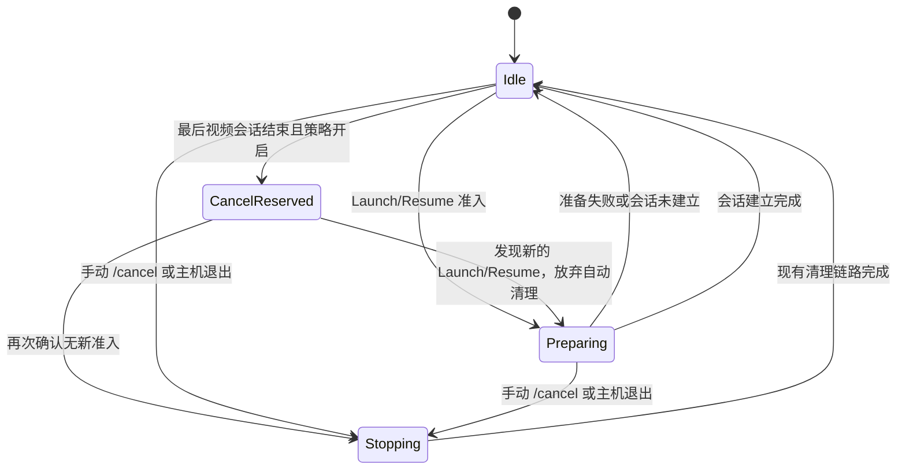
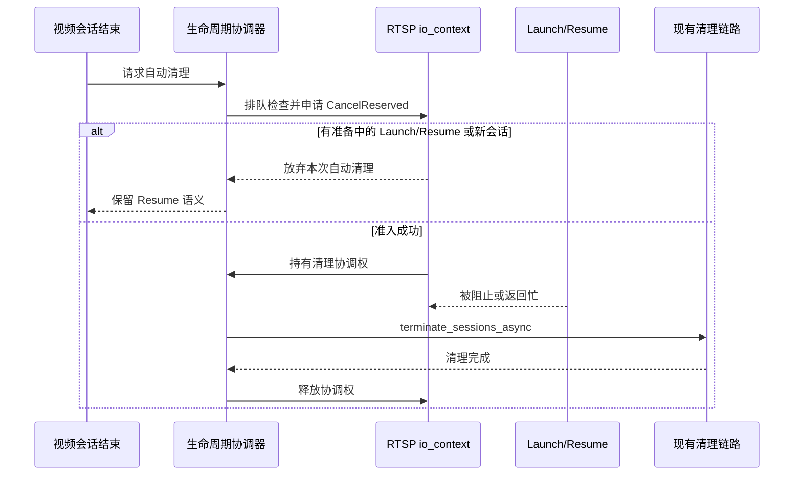

# 串流生命周期协调器设计

## 目的

“所有客户端断开后结束串流”只改变自动清理的触发条件，不应把 `stream.cpp` 变成一套新的全局会话状态机。当前实现继续复用现有 RTSP 会话清理链路；本设计描述后续版本如何补齐 Launch/Resume 准备阶段与自动清理之间的并发协调。

## 当前版本边界

当前功能只在视频会话计数归零后异步提交一次自动清理，并在 RTSP 执行上下文中再次检查视频会话和待处理票据。它能够避免重复提交和明显的过期清理，但“检查条件”和“开始清理”之间仍可能出现新的 Launch/Resume。这个窗口不在当前功能中扩展为重量级状态机，后续改造应单独评审和验证。

## 后续设计原则

- 只增加一个负责 Launch/Resume 准入和自动清理协调的 RTSP 组件，不改写视频、音频线程的生命周期。
- 状态由 RTSP `io_context` 所有；高频媒体路径不新增互斥锁或轮询线程。
- 预留清理动作必须先取得协调权，再清理票据和会话；协调权释放前，新的 Launch/Resume 不能进入会被清理覆盖的阶段。
- 手动 `/cancel`、主机退出和自动清理共享同一清理入口，保持停止顺序和幂等性。
- 控制专用会话不参与“最后一个视频会话”触发计数，但一旦全局清理获准，仍由同一入口收尾。
- 任何失败、取消、超时或异常都必须释放协调权，不能让 Sunshine 永久停在“清理中”。

## 最小状态模型

状态只表达跨请求必须协调的阶段，不记录每个客户端的重复信息：

| 状态 | 含义 |
| --- | --- |
| `Idle` | 没有待处理的全局清理；允许新的 Launch/Resume。 |
| `Preparing` | Launch/Resume 已取得准入权，正在建立显示、票据或 RTSP 会话。 |
| `CancelReserved` | 自动或手动清理已取得协调权；新的 Launch/Resume 必须等待或明确返回忙。 |
| `Stopping` | 已进入现有会话清理、应用终止和显示恢复链路。 |

不把“视频会话数”“待处理票据数”“控制专用会话数”复制进新状态机；这些仍由现有 RTSP 和 stream 计数提供事实来源。

## 关键不变量

1. 只有在视频会话数为零、没有待处理 Launch/Resume，并且能够取得 `CancelReserved` 时，自动清理才可以开始。
2. 取得 `CancelReserved` 到清理完成期间，新的 Launch/Resume 不能越过准入检查；否则自动清理必须放弃并释放协调权。
3. 清理动作只能通过现有 `terminate_sessions_async` 链路执行，不能复制一套应用终止、清理命令和显示恢复逻辑。
4. `CancelReserved`、`Stopping` 和结束回调均可重复收到请求，但最终效果必须幂等。
5. Sunshine 进程退出优先于自动清理，关闭流程负责最终释放所有状态。

## 流程

另一种表达是“先占用准入，再清理”，而不是“先读几个计数，再猜测清理是否安全”：

## 交互和失败处理

- 开关关闭：完全保留现有断线恢复行为，不走协调器的自动清理分支。
- 开关开启但新 Launch/Resume 已经开始：本次自动清理放弃，不终止新会话。
- 清理执行失败：记录稳定的本地日志，释放协调权；不阻塞 Sunshine 接受后续 Launch。
- 手动 `/cancel` 或主机关机：优先使用现有终止原因和清理顺序，不与自动任务重复清理。
- 只有控制专用会话：不触发自动清理；当自动清理已获准时，它们随全局链路一并结束。

## 验证要求

后续实现至少需要覆盖：

1. 最后视频会话结束与 Launch/Resume 同时到达；
2. 多个 Launch/Resume 同时到达时只有一个取得准入；
3. 自动清理与手动 `/cancel`、主机退出交错；
4. 清理回调抛异常、取消或超时后协调权仍能释放；
5. 控制专用会话存在时的清理；
6. 开关关闭时旧 Resume 行为不变。

真实 VDD、显示恢复和客户端 Resume 仍需在 Windows 环境做集成验证，单元测试不能替代驱动验证。

## 非目标

后续协调器不负责：

- 重写视频/音频线程状态；
- 为每个应用增加独立生命周期策略；
- 增加等待秒数、轮询线程或远程控制接口；
- 修改客户端 Resume 协议字段。
